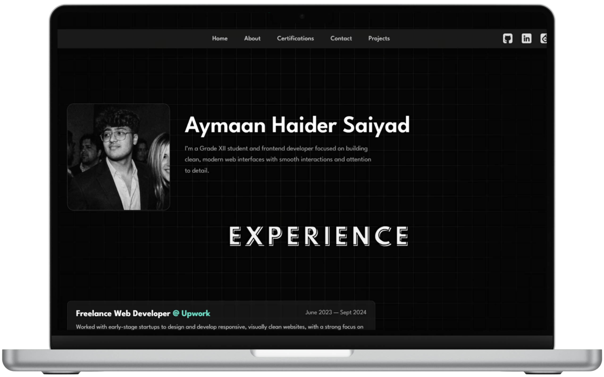

# 🌐 Personal Portfolio Website

  

---

A modern, minimal portfolio website showcasing my frontend projects, experience, and UI-focused web work.
This portfolio is designed with a strong emphasis on clean layouts, smooth interactions, and responsive design across devices.

---
<h2 align="center">
  🚀 https://ayymaaann.github.io/
</h2>

    
---

## ✨ Features

- Clean and minimal UI design  
- Fully responsive (desktop & mobile)
- Smooth hover effects and transitions
- Glassmorphism-inspired sections
- Dedicated sections for:
  > - Experience
  > - Projects
  > - Certifications
  > - Contact / Social links
- Optimized for performance and readability

---

## 🛠 Tech Stack

 
